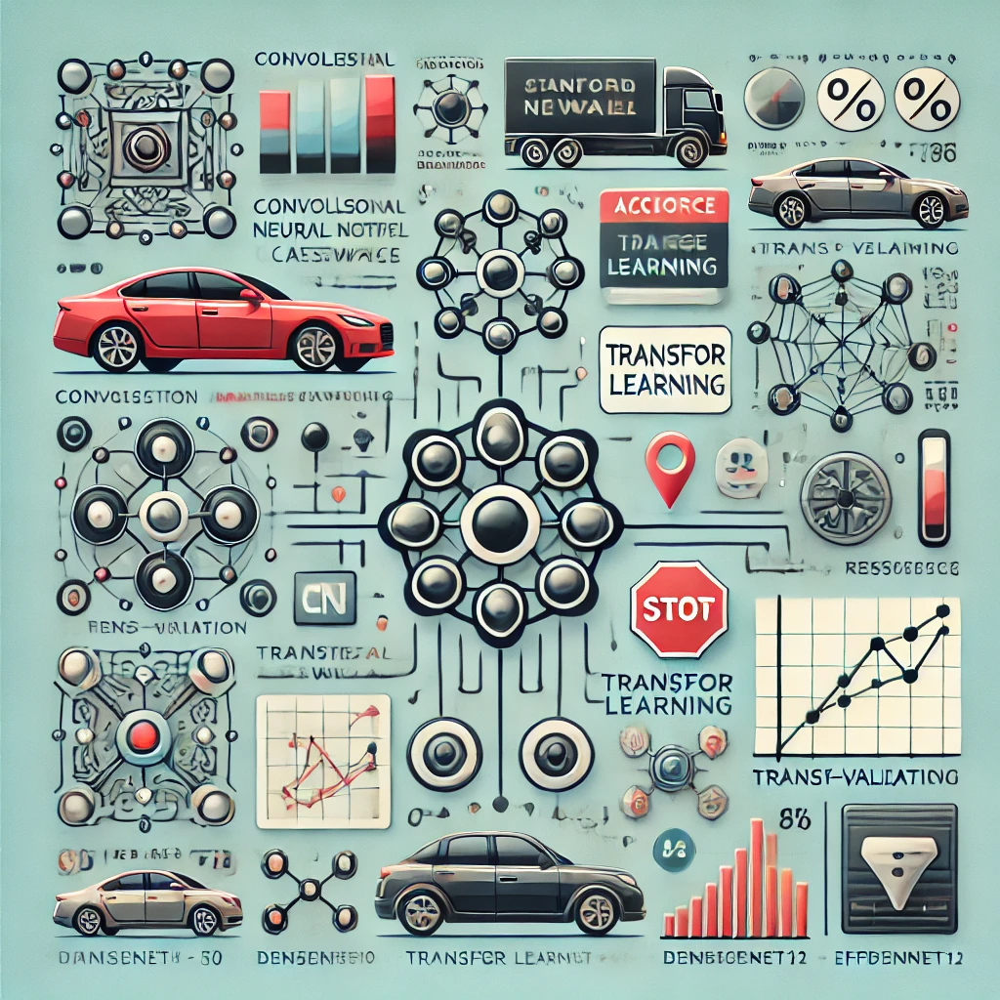

# Fine-Grained Car Classification with Deep Learning



## Overview
This project applies deep learning methods for fine-grained image classification on the Stanford Cars dataset. It includes a custom CNN model, improved architectures with residual blocks, and transfer learning with pre-trained models like ResNet50, DenseNet121, VGG16, and EfficientNet-B0. Evaluation includes k-fold cross-validation and comparison with Random Forest classifiers.

## Key Features
- Stanford Cars dataset (196 car classes).
- Custom CNN architecture with convolutional, pooling, and fully connected layers.
- Improved architecture with residual blocks and regularization.
- Transfer learning with pre-trained networks (ResNet, VGG, DenseNet, EfficientNet).
- Cross-validation for robust evaluation.
- Comparative analysis with Random Forest classifier using deep feature extraction.

## Technologies Used
- Python
- PyTorch
- Scikit-learn
- Matplotlib, Seaborn
- torchvision

## Project Structure
- `main.ipynb`: Training, evaluation, and experiments with all models.
- `Report.pdf`: Full report with architecture details, evaluation metrics, analysis, and insights.

## Dataset
- **Stanford Cars Dataset**
  - 16,195 images
  - 196 unique car classes
  - Includes bounding box annotations and class labels

## Methodology Highlights
- Image preprocessing and normalization
- Data augmentation: random flips, rotations, color jittering
- Residual block integration for improved learning
- Dropout, BatchNorm, L2 Regularization
- Learning Rate Scheduling (ReduceLROnPlateau)
- Cross-validation metrics visualization

## Performance Summary
| Model              | Test Accuracy | Test Loss |
|--------------------|----------------|-----------|
| Custom CNN         | ~25%           | 3.44      |
| Improved CNN + ResBlocks | ~45%           | 2.09      |
| ResNet50           | 90.29%         | 0.37      |
| DenseNet121        | 88.66%         | 0.64      |
| VGG16              | 81.84%         | 0.73      |
| EfficientNet-B0    | 79.33%         | 0.88      |
| Random Forest (ResNet Features) | 89.00%  | -         |

## Setup Instructions
1. Clone the repository:
```bash
git clone https://github.com/your-username/car-classification-deep-learning.git
cd car-classification-deep-learning
```
2. Install dependencies:
```bash
pip install torch torchvision scikit-learn matplotlib seaborn
```
3. Open the notebook:
```bash
jupyter notebook main.ipynb
```

## Notes
- Dataset should be downloaded manually from [Stanford Cars Dataset](https://ai.stanford.edu/~jkrause/cars/car_dataset.html).
- Ensure proper folder structure (`train`, `test`, and `annotations`).

---
This project demonstrates deep learning's potential for fine-grained image recognition and showcases how transfer learning boosts performance compared to custom CNNs.

